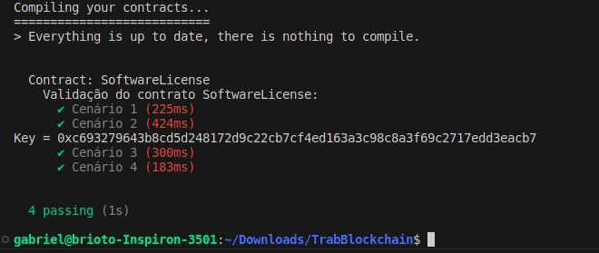

# Software License NFT

Este projeto consiste em um sistema de licenciamento de software que utiliza um contrato inteligente (smart contract) escrito em Solidity, uma linguagem de programação para contratos inteligentes na blockchain Ethereum. O objetivo principal do contrato inteligente é facilitar a venda e distribuição de licenças de software de maneira descentralizada e segura.

## Contrato Inteligente (SoftwareLicense)

O contrato inteligente é responsável por gerenciar as operações relacionadas à compra, distribuição e verificação de licenças de software. Ele incorpora as seguintes características:

- Propriedades do Contrato
- Modificadores
- Eventos e Funções 

## Como Testar no Truffle

### 1. Clone do repositório

```
git clone https://github.com/briotisk/SoftwareLicenseNFT.git
```
### 2. Instale o Truffle

O Truffle está disponível para download em https://trufflesuite.com/truffle/.

### 3. Abra o projeto

Com o Truffle instalado, acesse a raiz do projeto pelo terminal e execute o comando:

```
truffle test
```

### 4. Obtendo a chave

Ao executar o comando do passo anterior, a saída de sucesso esperada é:



Note que a chave de licença, neste caso, é o valor da variável ```key```.

### 2. Execução dos testes unitários


### 5. Execução da interface de teste
Abra a pasta ```interface``` e dê run no script ```interface_python.py```:

```
python interface_python.py
```

Em seguida uma janela se abrirá, insira a chave de licença recebida no contrato inteligente e veja que uma mensagem vai aparecer informando se a chave é válida.