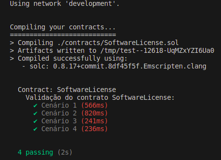
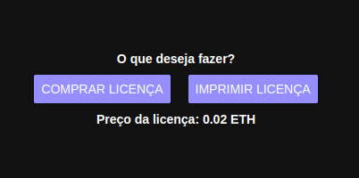
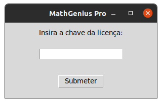

# Software License NFT

Este projeto consiste em um sistema de licenciamento de software que utiliza um contrato inteligente (smart contract) escrito em Solidity, uma linguagem de programação para contratos inteligentes na blockchain Ethereum. O objetivo principal do contrato inteligente é facilitar a venda e distribuição de licenças de software de maneira descentralizada e segura.

## Contrato Inteligente (SoftwareLicense)

O contrato inteligente é responsável por gerenciar as operações relacionadas à compra, distribuição e verificação de licenças de software. Ele incorpora as seguintes características:

- Propriedades do Contrato
- Modificadores
- Eventos e Funções 

## Configurando o Ambiente de Desenvolvimento

### 1. Clone do repositório

```
git clone https://github.com/briotisk/SoftwareLicenseNFT.git
```
### 2. Instalando as dependências

Antes de começar a executar os códigos do projeto é preciso se certificar que o Node.js instalado na sua máquina. Uma forma muito simples de realizar essa verificação é executando o comando abaixo:

```
node --version
```

Ou simplesmente: 

```
node -v
```

Caso ele esteja instalado a saída deve ser algo como:

```
v16.20.2
```

Para obter instruções de como proceder com a instalação, visite o site: https://Node.js.org/en/learn/getting-started/how-to-install-Node.js.

Outro ponto importante é que o Truffle requer uma versão do Node.js entre as versões v14 e v18. Logo se sua versão não satisfaz essa condição, é possível utilizar o ``nvm`` para gerenciar diferentes versões do Node.js. Para mais informações sobre instalação e uso desse pacote, consulte: https://github.com/nvm-sh/nvm.git.

Uma vez que o Node.js esteja devidamente configurado para uma versão compatível, podemos instalar o restante das dependências utilizando o ``npm``, gerenciador de pacotes do Node.js.

O projeto conta com dois arquivos ``package.json``, o primeiro referente ao projeto como um todo e o outro referente à aplicação web que podem ser utilizados para instalar quase todas as dependências necessárias. 

Assim, no diretório raiz do projeto, digite o comando:

```
npm install
```

Ou apenas

```
npm i
```

Com isso, caso corra tudo bem, todas as dependêncais serão instaladas automaticamente. Elas envolvem o pacote Truffle, o Ganache CLI e outros pacotes necessários ao projeto, todos listados pelo ``package.json``.

Em seguida, navegue entre os diretórios para acessar os códigos fonte da aplicação web usando o seguinte comando:

```
cd interface/InterfaceWeb
```

Em seguida, utilize novamente um dos comandos listados anteriormente para instalar as dependências do projeto da aplicação web.

Por fim, a última dependência a ser instalada é uma biblioteca do Python. Para tanto, no Ubuntu, utilize o comando abaixo para instalá-lo:

```
sudo apt-get install python3-tk
```

Com tudo isso feito, o ambiente está devidamente configurado para iniciar a execução do projeto.

### 3. Executando os testes automatizados

O projeto conta com alguns testes unitários que compõem um script de testes localizado no diretório ``test``. 

Para a execução dos testes, recomenda-se editar o script ``1_initial_migration.js`` localizado no diretório ``migrations`` para que o código dele seja:  

```javascript
const SoftwareLicense = artifacts.require("SoftwareLicense");
const { ethers } = require("ethers");

module.exports = function(deployer) {
  deployer.deploy(SoftwareLicense, 0, "");
};
```

Depois, execute o Ganache CLI por meio do comando:

```
ganache-cli
```

Com o ganache em execução, abra outra janela do terminal, vá até o diretório raiz do projeto e execute o comando:

```
truffle test
```

Ou, se preferir:

```
npm test
```

Com isso, se todos os testes forem bem sucedidos, a saída deve ser semelhante ao ilustrado na imagem abaixo:

<p align="center">
    
</p>

Caso seja seu desejo escrever mais testes automatizados para testar o contrato, vale a pena navegar no seguinte site para obter mais instruções de como escrevê-los: https://trufflesuite.com/docs/truffle/how-to/debug-test/write-tests-in-javascript/.

### 4. Deploy do contrato

Para realizar o deploy do contrato, foi escrito um script que permite ao desenvolvedor definir via terminal o valor da licença (em ETH) e a palavra que servirá de seed para a geração da licença.

Assim, basta editar o script ``1_initial_migration.js`` localizado no diretório ``migrations`` para que o código dele seja:  

```javascript
const SoftwareLicense = artifacts.require("SoftwareLicense");
const { ethers } = require("ethers");

let inputReader = require('readline-sync');
let licensePrice = inputReader.question("Digite o preço da licença em ETH: ");
let licenseSeed = inputReader.question("Digite a string que servirá de seed para a licença: ");

module.exports = function(deployer, network) {
  deployer.deploy(SoftwareLicense, ethers.parseEther(licensePrice, 18), licenseSeed);
}
```

Para realizar os deploys em testnets públicas, é preciso utilizar um provedor para se conectar à rede. Por sorte, a Metamask é uma opção, assim, é possível utilizar sua Metamask para realizar o deploy do contrato. Para que isso seja possível, utiliza-se o pacote ``hdwallet-provider``. 

Mas para que a conexão com a Metamask seja bem sucedida, é preciso informar a sua frase mnemônica. Sabendo que este é um dado sensível, o programa foi pensado para evitar que ela fique exposta no código. Portanto, utilizou-se o pacote ``dotenv`` para aumentar a proteção sobre esse dado. Assim, basta criar um arquivo nomeado ``.env`` e inserir sua frase secreta nele da seguinte forma:

```
SECRET=palavra1 palavra2 palavra3...
```

> *Obs: Quando for publicar seu código fonte em algum lugar, como um repositório do github, certifique-se de deixar esse arquivo de fora adicionando-o ao .gitignore, por exemplo, para que ninguém tenha acesso à sua frase mnemônica.

Uma vez que toda essa configuração estiver pronta, vá até o diretório raiz do projeto, e execute o seguinte comando

```
truffle migrate --network <nome da rede aqui>
```

No caso deste projeto, há duas redes configuradas, uma com o nome "development", que está configurada para a blockchain do ganache, e outra com o nome "goerli" que está configurada para a testnet pública Goerli. 

É possível configurar redes adicionais, como a mainnet da Ethereum ou até outras testenets alterando o arquivo ``truffle-config.js`` no diretório raiz do projeto. Para mais informações de como realizar essa configuração, acesse: https://trufflesuite.com/docs/truffle/reference/configuration/#networks.

### 5. Execução da interface web

Para executar a interface web, vá até o diretório ``InterfaceWeb`` e digite o comando:

```
npm start
```

Com isso a aplicação deve ser iniciada em um servidor local e para abri-la no navegador basta pressionar a tecla "w".

Assim, na interface web, basta dar permissão para que ela se conecte à Metamask e em seguida deve ser exibida uma nova tela que onde há a possibilidade de comprar ou imprimir a licença do software.

<p align="center">
    
</p>

### 6. Execução da interface de teste

Navegue até a pasta ```interface``` e execute o script ```interface_software.py```:

```
python interface_software.py
```

Ou ainda:

```
python3 interface_software.py
```

Em seguida uma janela se abrirá, insira a chave de licença recebida no contrato inteligente e veja que uma mensagem é exibida, informando se a chave é válida ou não.

<p align="center">
    
</p>
